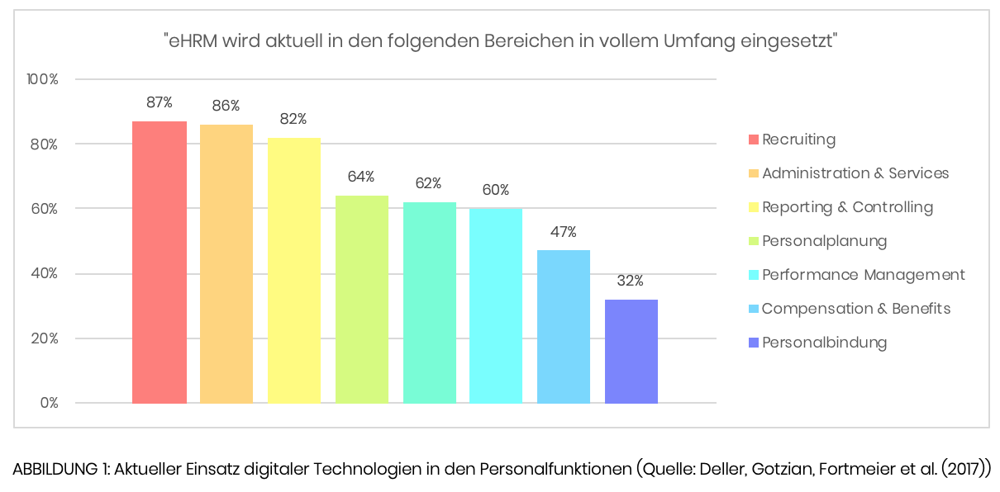
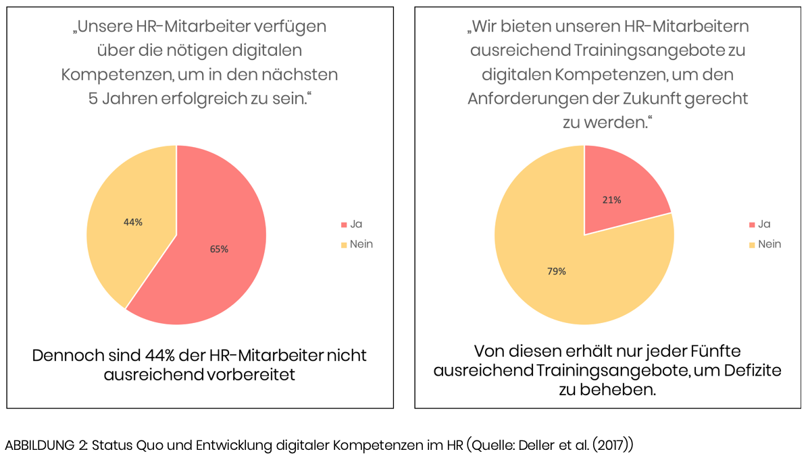

## Einleitung

Digitalisierung steht laut dem Bundesministerium für Wirtschaft und Energie für die umfassende Vernetzung in allen Bereichen der Wirtschaft und Gesellschaft sowie für die Fähigkeit, relevante Informationen zu sammeln, zu analysieren und in Handlungen umzusetzen (BMWI, 2015).

Demnach ist jedes Unternehmen davon betroffen und dem Personalmanagement wird dabei eine erfolgskritische Rolle zugeschrieben. In einer Studie der Deutschen Gesellschaft für Personal (DGFP) ist die Digitalisierung schon länger einer der maßgeblichen Trends. Ein Drittel der in der Studie befragten Unternehmen rechnen mit einem starken Einfluss der Digitalisierung auf das Personalmanagement. Dabei geht es einerseits um die effizientere Gestaltung von Personalprozessen und andererseits um eine verstärkte strategische Integration der Personalfunktion ins Unternehmen (Armutat, 2015). HR (Human Resources) steht nun also vor einer wichtigen Entscheidung: Transformieren sie sich selbst und blieben damit Treiber der Transformation oder bleiben sie beim Alten und sterben langsam aus (BPM, 2016).

## Technologien innerhalb der Personalfunktionen

### Personalsoftware

Die Digitalisierung im Personalbereich ist bereits im vollen Gang. Früher wurden sämtliche Mitarbeiterinformationen und Berichte auf Papier erstellt. Die komplette Lohn- und Gehaltsabrechnung wurde per Hand erledigt und jegliches Trainingsvorhaben musste zwangsläufig immer persönlich und vor Ort durchgeführt werden – mit komplexen Terminfindungen und Reiseaufwänden. All dies wird heutzutage fast nur noch am Computer oder über mobile Endgeräte mithilfe von Softwarelösungen und weitergreifenden Informationssystemen erledigt.

Bereits in den 1950ern wurden erste Informationssysteme entwickelt. Insbesondere im Bereich der Buchhaltung und des Supply Chain Managements wurden diese Systeme weiterentwickelt. Der Personalbereich war einer der letzten Bereiche, der hiervon profitieren konnte. Die ersten computerbasierten Lösungen im Personalbereich wurden vor allem für die Lohn- und Gehaltsabrechnung genutzt (Johnson, Lukaszewski & Stone, 2016). In der Mitte der 90er Jahre haben Personalabteilungen angefangen ERP (Enterprise Resource Planning) Systeme für die verschiedensten Funktionen zu nutzen. Seit 2010 kamen auch die Cloud basierten Softwarelösungen dazu. Diese sind standardisierter (wenn auch weiterhin anpassbar an die eigene Organisation) und einfacher zu nutzen, da sie über einen Webbrowser direkt verfügbar sind (Johnson et al., 2016). Mittlerweile profitiert jeder Aspekt der Personalarbeit von zahlreichen Softwarelösungen und wird dadurch immer effizienter und weniger administrativ (Stone, Deadrick, Lukaszewski & Johnson, 2015). Heutzutage gibt es kaum ein Unternehmen, dass nicht eine solche Softwarelösung nutzt (Johnson et al., 2016).

Laut einer Studie der Leuphana-Universität Lüneburg (Deller et al., 2017) wird in den folgenden Bereichen Personalsoftware eingesetzt:

Personalsoftware kann nicht nur bei den klassischen administrativen Aufgaben unterstützen, sondern auch ein strategischer Vorteil sein. Indem die aktuelle Softwarelösung effizienter gemacht wird, können Kosten und Zeit gespart werden. Wenn die Software relevante Daten für die Unternehmensführung generiert, kann sie aus dem Personalbereich einen strategischen Partner machen (Bell, 2015).

### Analytics

HR Analytics wird wie folgt definiert: „HR Analytics wird genutzt, um beschreibende, visuelle und statistische Analysen von Daten, die auf HR Prozessen, Humankapital, Unternehmensleistung und externe ökonomische Benchmarks basieren, um die Auswirkungen auf das Unternehmen zu erfassen und datenbasierte Entscheidungen zu treffen.“ (Marler & Bodreau, 2017).

Dabei liegt der Fokus nicht primär auf Kennzahlen und klassischen KPIs (Key Performance Indicators), sondern es wird versucht anhand von Beziehungen, Kausalitäten, Einflüssen und Wechselwirkungen zwischen internen und externen Bereichen einen Blick in die Zukunft zu werfen. Dabei werden die Ursachen von aktuellen Ereignissen analysiert und Handlungsalternativen gefunden, mit denen ein gewünschtes Ereignis herbeigeführt werden kann. Es kann z.B. herausgefunden werden, wodurch die Fluktuationsrate beeinflusst wird und wie man Mitarbeiter/innen stärker an Unternehmen binden kann (Ruf, 2019).
Aktuell wird das Potential von HR Analytics noch nicht vollständig genutzt. Beispielsweise werden sie oft nicht in unternehmerischen Entscheidungen herangezogen (Marler & Bodreau, 2017). Das größte Potential liegt in der Verknüpfung der Datenquellen durch Algorithmen. Hierzu nutzt man Künstliche Intelligenz zur Generierung von Smart nutzbaren Datensätzen (BPM, 2016).

Mögliche Anwendungsgebiete für HR Analytics sind: Passende Kandidaten mithilfe akkurater Daten schnell und sicher finden oder anonymisierte Personaldaten nutzen, um rechtlichen und ethischen Regularien gerecht zu werden (BPM, 2016). Allerdings leiden insbesondere auf Algorithmen basierte Auswahlmethoden unter mangelndem Vertrauen in HR Abteilungen (Deller et al., 2017).

Um HR Analytics effektiv im Unternehmen aufzubauen, muss es Mitarbeiter/innen geben, die die Kompetenz haben Daten korrekt zu sammeln, statistisch zu analysieren und sinnvoll zu kommunizieren (Marler & Bodreau, 2017). Auch die Qualität der vorhandenen Daten kann insbesondere durch sogenanntes Silodenken leiden (Angrave, Charlwood, Kirkpatrick, Lawrence & Stuart, 2016).

## Einfluss der Digitalisierung auf die Rolle von HR

### Agile Organisationen

Die Digitalisierung beeinflusst nicht nur Technologien innerhalb des Personalbereiches, sondern auch die Arbeitsweise im Unternehmen. Es wird vielmehr nötig sein, sein Unternehmen flexibler und anpassungsfähiger zu gestalten, da sich das Umfeld stetig verändert. Hierfür werden selbst-organisierte Teams, Hierarchiefreiheit, Innovationsräume und Daten- und Entscheidungstransparenz benötigt (Lenz, 2017). Dabei verschwimmen die Grenzen zwischen Arbeits- und Privatleben und beide Bereiche dringen in den jeweils anderen ein (Ruf, 2019).

Aktuell sind die meisten Unternehmen in einer Transformationsphase, um zumindest einige dieser Aspekte in ihre Kultur zu integrieren (Lenz, 2017). Personalabteilungen müssen hier ihr Unternehmen bei der Veränderung unterstützen (Cappelli, 2015) und insbesondere die Führungskräfte dementsprechend schulen (Rump & Schiedhelm, 2015). Darüber hinaus müssen alle Mitarbeiter/innen langfristig die entsprechenden erfolgskritischen Kompetenzen entwickeln. HR muss hierbei die Potenziale erkennen, fördern und entsprechende Mitarbeiter/innen langfristig an das Unternehmen binden. Generell müssen Personalabteilungen in Zukunft mit allen Bereichen im Unternehmen, insbesondere der IT, partnerschaftlich zusammenarbeiten, um gemeinsame Lösungen zu finden (Lenz, 2017).

Laut dem Bundesverband der Personalmanager (BPM) bringen die neuen Arbeitsformen den Mitarbeiter/innen mehr Möglichkeiten zur Selbstbestimmung und HR einen größeren Gestaltungsspielraum (BPM, 2016). Allerdings verlangen diese Veränderungen in der Arbeitswelt von Mitarbeiter/innen eine erhöhte Flexibilität, da sich ihr Arbeitsumfeld stetig ändert. Für diesen Kulturwandel werden insbesondere Führungskräfte benötigt, die eine Vorbildfunktion sind und damit auch die restlichen Mitarbeiter/innen mitnehmen (Ruf, 2019).

### Kompetenzentwicklung

Laut der Studie „Digitale Agenda 2020“ nennen 37% der Unternehmen die technischen Aus- und Weiterbildungslücken ihrer Mitarbeiter als größten Stolperstein, damit sie ihre digitale Agenda starten können. Unter anderem deswegen wird es immer relevanter sein Leben lang zu lernen. Dabei ist die interne Weiterbildung in der Zukunft wichtiger als die Neueinstellung von hochqualifizierten Arbeitskräften. Dies geschieht weniger in klassischen Schulungen und immer mehr direkt am Arbeitsplatz – durch Kollegen/-innen oder durch kleinere Lerneinheiten (z.B. durch Online-Learning) (Haufe Online Redaktion, 2017). Das sogenannte arbeitsintegrierte Lernen verkürzt die Transferzeit zwischen Lernen und Anwenden und ist damit besonders effektiv (Ruf, 2019).

Der Fokus sollte dabei nicht nur auf den technischen Kompetenzen liegen, sondern insbesondere auch auf den sogenannten Soft Skills wie Führungsstärke, kritisches Denken, Kreativität und emotionale Intelligenz. Dies gilt sowohl für Personalabteilungen als auch für die restlichen Mitarbeiter/innen des Unternehmens (Zeoli & Billeter, 2019).

In der folgenden Abbildung wird ersichtlich inwiefern HR Abteilungen über die notwendigen Kompetenzen verfügen, die Digitalisierung bis 2023 zu bewältigen.

Auch Online-Learning hat sich mit der Zeit verändert. Mittlerweile können durch Augmented Reality lebensechte Situationen nachgestellt werden und durch Serious Gaming kann der Berufsalltag gamifiziert werden. Außerdem können Mitarbeiter/innen all dies nicht nur vom Desktop-PC des machen, sondern von überall, von jedem Gerät und zu jeder Uhrzeit. Hierbei ist es Aufgabe der Personalabteilung für jeden fachlichen Inhalt das entsprechende Format zu finden. Dabei sollte auf die unterschiedlichen Lernpräferenzen der Mitarbeiter/innen geachtet werden (BPM, 2016). Auch steigt die Relevanz von eigenen Ausbildungsprogrammen, um die zukünftigen Mitarbeiter/innen entsprechend auf die für das Unternehmen relevanten Bereiche vorzubereiten (Ruf, 2019).

## Zusammenfassung

Das Feld des Personalmanagements bekommt mit der Digitalisierung also eine Handvoll an Aufgaben mit auf den Weg. Nun muss es sich nur noch als gestalterische, strategische Funktion aktiv im Unternehmen einbringen. Ansonsten bleibt es eine unternehmens-politisch marginale Rolle, die in erster Linie durch administrative Prozesse bekannt ist (Ruf, 2019).

Insbesondere in Deutschland ist das Arbeitsrecht aber noch nicht unbedingt mit der Digitalisierung vereinbar. Durch die Auflösung klassischer Betriebsstrukturen ergeben sich neue Herausforderungen, da z.B. keine klassischen Weisungsrechte mehr vorhanden sind. Auch die Möglichkeiten zu jeder Zeit und an jedem Ort zu arbeiten sind aktuell laut den Gesetzen noch nicht vorgesehen. Zudem sieht das deutsche und europäische Gesetz einen sehr hohen Schutz der Mitarbeiterdaten vor, welches ein sehr wichtiges Thema ist, mit dem sich Unternehmen beschäftigen müssen (BPM, 2016). Hier müssen sowohl Politik als auch Unternehmen zusammenarbeiten, um optimale Lösungen zu finden, die sowohl für den Arbeitnehmer als auch das Unternehmen zufriedenstellend sind.

### Quellen

Angrave, David, Charlwood, Andy, Kirkpatrick, Ian, Lawrence, Mark & Stuart, Mark (2016): HR and analytics: why HR is set to fail the big data challenge. Human Resource Management Journal, 26(1), S. 1-11.

Armutat, Sascha (2015): [DGFP-STUDIE MEGATRENDS 2015](https://www.dgfp.de/fileadmin/user_upload/DGFP_e.V/Medien/Publikationen/Studien/2015-09-09-StudieMegatrend.pdf). Zugegriffen: 13.10.2019.

Bell, Lisa (2015): Transactional versus Strategic use of HR Software and Technology. Human Resources Magazine, 19(6), S. 6-8.

Bundesministerium für Wirtschaft und Energie (BMWI) (2015): [Industrie 4.0 und
Digitale Wirtschaft](https://www.bmwi.de/Redaktion/DE/Downloads/I/industrie-4-0-und-digitale-wirtschaft.html). Zugegriffen am 13.10.2019.

Bundesverband der Personalmanager e.V. (BPM) (2016): [Personalmanagement 4.0](https://www.bpm.de/personalmanagement-40). Zugegriffen am 13.10.2019.

Cappelli, Peter (2015): Why We Love to Hate HR... and What HR Can Do About It. Harvard Business Review, 93(7/8), S. 54-61.

Deller, Jürgen, Gotzian, Lisa, Fortmeier, Maike et al. (2017): [DIGITAL-INVENTUR: STATUS DER DIGITALEN TRANSFORMATION IM HR](https://lisagotzian.com/wp-content/uploads/2019/05/Deller-Gotzian-Fortmeier-etal.-Digitalinventur.pdf). Zugegriffen am 13.10.2019.

Haufe Online Redaktion (2017): [Wie die Digitalisierung die HR-Agenda verändert](https://www.haufe.de/personal/hr-management/arbeiten-40-digitalisierung-veraendert-hr-agenda_80_397934.html). Zugegriffen am 22.09.2019.

Johnson, Richard D., Lukaszewski, Kimberly M. & Stone, Dianna L. (2016): The Evolution of the Field of Human Resource Information Systems: Co-Evolution of Technology and HR Processes. Communications of the Association for Information Systems, 38, S. 533-553.

Lenz, Ulrich (2017): Agile Organisation – und was macht HR?. In: Nachtwei, Jens & von Bernstorff, Charlotte (Hrsg.): HR Consulting Review – Band 8 (S. 13-16).

Marler, Janet H. & Boudreau, John W. (2017): An evidence-based review of HR Analytics. The International Journal of Human Resource Management, 28, S. 3-26.

Ruf, Michael (2019): Personalmanagement 4.0. In: Erner, Michael (Hrsg.): Management 4.0 – Unternehmensführung im digitalen Zeitalter (S. 349-387). Berlin: Springer Gabler.

Rump, Jutta & Schiedhelm, Melanie (2015): Personalführung heute – Führen nach Gusto?. In: Nachtwei, Jens & von Bernstorff, Charlotte (Hrsg.): HR Consulting Review – Band 6 (S. 34- 38).

Stone, Dianna L., Deadrick, Diana L., Lukaszewski, Kimberly M., & Johnson, Richard (2015): The Influence of Technology on the Future of Human Resource Management. Human Resource Management Review, 25, S. 216-231.

Zeoli, Michael L. & Billeter, Kim (2019): Transforming HR to be more digital (and more human). Workforce Solutions Review, 10(1), S. 4-7.
